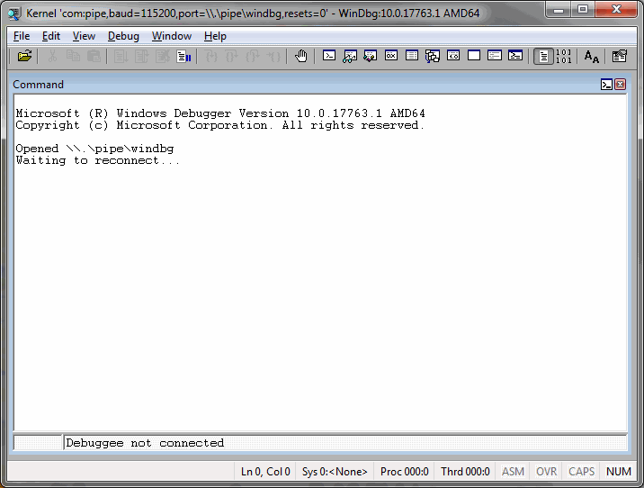
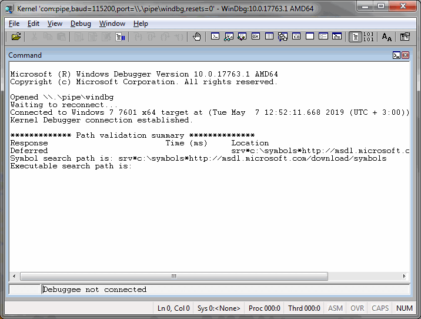
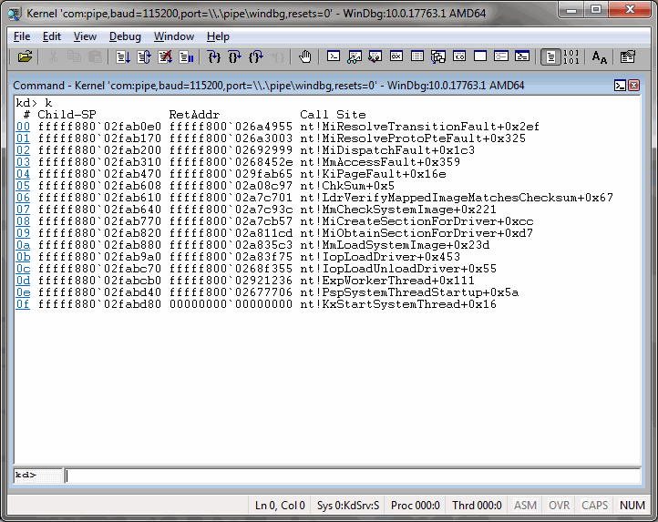
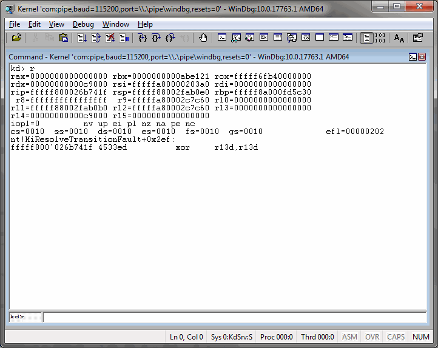

# WinDbg server

**WinDbg** is a multipurpose debugger for the Microsoft Windows computer operating system, distributed by Microsoft. Recent versions of WinDbg have been and are being distributed as part of the free _Debugging Tools for Windows_ suite.
***

How to start debugging QEMU using WinDbg:
* Run QEMU with next option: ```-windbg pipe:<name>```
* QEMU will start and pause for waiting WinDbg connection.
* Run WinDbg with next options: ```com:pipe,baud=115200,port=\\.\pipe\<name>,resets=0```
* Wait until debugger connects to the kernel.
* Press 'ctrl+break' for break.

You can add _Symbol Search Path_ in WinDbg such as   
`srv*c:\symbols*http://msdl.microsoft.com/download/symbols`

## WinDbg server details

The WinDbg debugger has the possibility of connecting to a remote debug server
(Kdsrv.exe) in the Windows kernel. Therefore, it is possible to connect
to the guest system running in the QEMU emulator. Kernel debugging is possible
only with the enabled debugging mode, may change at the same time.
Our module of WinDbg debugger for QEMU is an alternative of the remote debugging
service in the kernel. Thus, the debugger connects to the debugging module,
not to the kernel of the operating system. The module obtains all the necessary
information answering debugger requests from the QEMU emulator. At the same time
for debugging there is no need to enable debugging mode in the kernel.
This leads to hidden debugging. Our module supports all features of WinDbg
regarding remote debugging, besides interception of events and exceptions.
Supports i386 and x86_64 architectures.

## Examples:

### Startup:
Run qemu and windbg, and wait:




Now, press 'ctrl+break' and wait stopping:


### View process list:


### View call stack:


### View registers:


### Breakpoints:
Set breakpoints and press 'go':


